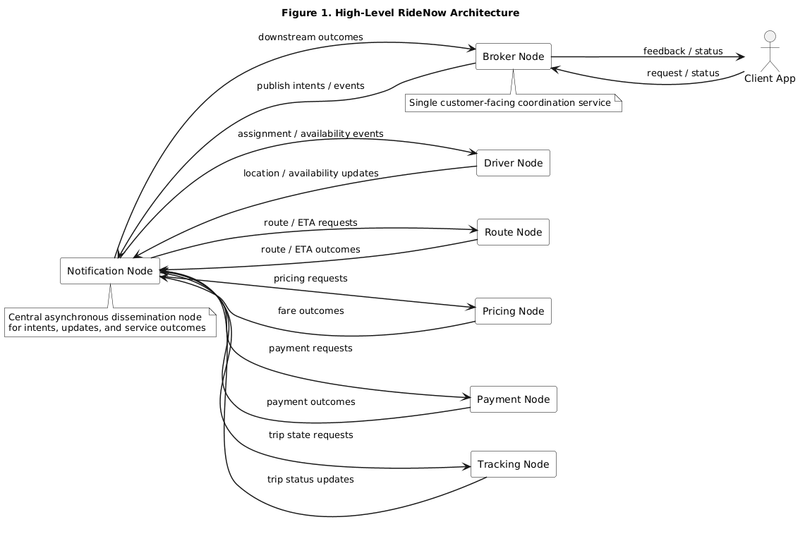
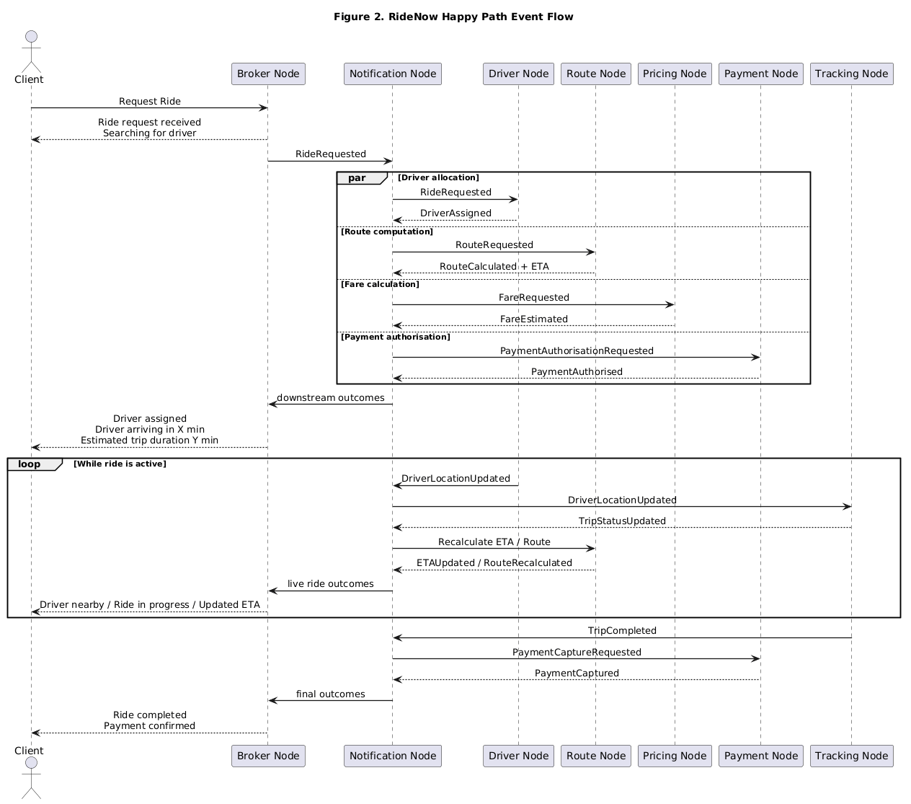

# RideNow Ride-Hailing Platform Architecture Proposal

## 1. Introduction

This document presents a proposed architecture for **RideNow**, a client-oriented ride-hailing platform. Formally, the platform is designed as a **microservice architecture** organised around business capabilities rather than technical layers. At the same time, the platform is intentionally described using a **graph of service-nodes**.

This is a deliberate design choice. Selected communication-model ideas are consciously borrowed from **ROS 2**, not to turn RideNow into a robotics platform, but to strengthen the architectural description of a distributed, event-driven system. In particular, the design adopts:
- a graph-oriented view of distributed computational units;
- independent units that own their own state and behaviour;
- predominantly asynchronous propagation of information between units;
- limited use of direct request/reply interaction where immediate feedback is required.

Borrowing these ideas strengthened the **hexagonal architecture** of the platform, because each service became easier to define as an independent bounded-context unit with clear ports, adapters, and local state. It also extended the **data-driven** character of the platform, because system behaviour is increasingly driven by the flow of events, notifications, location updates, routing updates, and payment outcomes rather than by long synchronous control chains.

Accordingly, RideNow is presented as a microservice system whose services may also be viewed as **service-nodes** in a distributed graph. This allows the document to stay within the expected microservice vocabulary of the assignment while using a graph-based interaction model that is especially useful for reasoning about routing, notification flows, timing, and eventual consistency.

The central design principle is client responsiveness: when the customer performs an action, the platform should acknowledge that action quickly and provide correct, customer-meaningful feedback as soon as possible.

---

## 2. Architectural Style

RideNow is designed as a **client-oriented microservice architecture**, and those microservices are modelled as a **distributed graph of hexagonal service-nodes** for communication and coordination purposes.

This means that:

- each service-node represents a distinct business capability;
- each service-node owns its own behaviour and local data;
- each service-node is internally structured using hexagonal architecture;
- node-to-node coordination is mainly event-driven;
- the client interacts with a single customer-facing coordination service rather than directly with every internal service.

The architecture is intended to support loose coupling, clear ownership, scalability, and eventual consistency.

### Figure 1. High-Level RideNow Architecture

The diagram shows the client-facing role of the Broker, the central dissemination role of the Notification node, and the asynchronous propagation of state changes and outcomes across the other bounded capabilities.

---

## 3. Client-Oriented Platform View

The platform is designed around the customer journey rather than around infrastructure concerns.

### Customer-visible states

The customer should receive clear and meaningful states such as:

1. Request Submitted
2. Waiting for Driver
3. Driver Assigned
4. Driver Arriving
5. Ride In Progress
6. Ride Completed
7. Payment Processing
8. Payment Confirmed
9. Complaint Submitted
10. Issue Under Review
11. Resolved / Refunded
12. Cancelled / Failed

The internal system may be more complex, but the customer-facing model should remain simple and understandable.

---

## 4. Final Service-Node Catalogue

The final RideNow architecture consists of the following seven nodes:

1. **Broker Node**
2. **Driver Node**
3. **Route Node**
4. **Pricing Node**
5. **Payment Node**
6. **Tracking Node**
7. **Notification Node**

---

## 5. Node Responsibilities and Owned Data

### 5.1 Broker Node

The Broker Node is the main customer-facing coordination node.

#### Responsibilities
- accept customer requests;
- return immediate acknowledgements;
- convert customer actions into notifications/events;
- receive outcomes from internal nodes;
- translate internal outcomes into customer-visible feedback;
- manage the overall customer interaction flow;
- accept complaints and issue requests from the customer.

#### Owned data
- customer interaction state;
- correlation identifiers;
- customer-visible workflow status;
- aggregated customer journey view.

---

### 5.2 Driver Node

The Driver Node represents the driver domain.

#### Responsibilities
- maintain driver profile data;
- maintain vehicle data;
- manage driver availability and online/offline status;
- publish periodic driver location updates;
- report whether a driver is available and suitable for assignment.

#### Owned data
- driver profile;
- vehicle profile;
- availability state;
- service area / eligibility;
- current location snapshot.

---

### 5.3 Route Node

The Route Node is responsible for routing and ETA estimation.

#### Responsibilities
- calculate the route from driver to pickup;
- calculate the route from pickup to drop-off;
- compare candidate routes;
- choose the fastest route;
- estimate ETA and distance;
- perform route recalculation when needed.

#### Owned data
- route request state;
- candidate route evaluations;
- ETA estimates;
- distance estimates;
- selected route metadata;
- rerouting history/state.

---

### 5.4 Pricing Node

The Pricing Node is responsible for fare calculation.

#### Responsibilities
- calculate fare estimates;
- apply pricing rules;
- use route, ETA, and distance information;
- calculate the final fare.

#### Owned data
- pricing rules;
- surge logic;
- fare estimate data;
- final fare calculation state.

---

### 5.5 Payment Node

The Payment Node is responsible for payment processing.

#### Responsibilities
- authorise payments;
- capture payments;
- issue refunds;
- publish payment outcomes;
- participate in issue/refund flows where relevant.

#### Owned data
- payment transactions;
- authorisation state;
- capture state;
- refund records;
- payment failure reasons.

---

### 5.6 Tracking Node

The Tracking Node is responsible for ride execution monitoring.

#### Responsibilities
- process live ride progress;
- use location-derived updates;
- determine key operational states such as driver arrival, trip start, and trip completion;
- detect deviation from the expected route;
- trigger rerouting input when required.

#### Owned data
- trip execution state;
- live progress state;
- arrival/start/completion state;
- deviation and recalculation triggers.

---

### 5.7 Notification Node

The Notification Node is the inter-service dissemination node.

#### Responsibilities
- propagate cross-node notifications/events;
- make customer-originated intents available to relevant nodes;
- make service outcomes available to Broker and other interested nodes;
- support asynchronous propagation;
- contribute to eventual consistency.

#### Owned data
- dissemination log;
- routing metadata;
- delivery status;
- retry metadata.

---

## 6. Graph Model of the Platform

RideNow can be represented as a directed graph.

### Vertices

`V = {Broker, Driver, Route, Pricing, Payment, Tracking, Notification}`

### Directed edges

- Client -> Broker
- Broker -> Notification
- Notification -> Driver
- Notification -> Route
- Notification -> Pricing
- Notification -> Payment
- Notification -> Tracking
- Driver -> Notification
- Route -> Notification
- Pricing -> Notification
- Payment -> Notification
- Tracking -> Notification
- Notification -> Broker
- Broker -> Client

### Interpretation

- the customer interacts only with the Broker;
- the Broker publishes customer intent;
- internal nodes react asynchronously;
- outcomes return through the Notification node;
- the Broker converts those outcomes into client-visible status updates.

---

## 7. Hexagonal Structure Within Each Node

Each RideNow node follows the same internal architectural shape:

- **Domain Core**
- **Inbound Ports**
- **Outbound Ports**
- **Inbound Adapters**
- **Outbound Adapters**

### Example: Broker Node

#### Domain Core
- customer intent handling;
- customer-facing status translation;
- journey coordination.

#### Inbound Ports
- request ride;
- cancel ride;
- query ride status;
- submit complaint or issue.

#### Outbound Ports
- publish notification;
- consume service outcomes;
- query selected domain data when required.

#### Inbound Adapters
- REST/mobile API.

#### Outbound Adapters
- message broker adapter;
- optional synchronous API adapters.

---

## 8. Temporal Model

Time and responsiveness are part of the architecture.

### 8.1 Client acknowledgement time

This is the time taken to return the first meaningful response to the customer after an action is performed.

Examples:
- Ride request received
- Searching for driver
- Payment processing
- Issue received

This should be as small as possible.

### 8.2 Business outcome time

This is the time taken for the system to reach a later operational result such as:
- driver assigned;
- route calculated;
- payment authorised;
- trip completed;
- refund issued.

These outcomes may take longer, but the customer must still receive correct intermediate feedback.

---

## 9. Node-Level Externalised Configuration

There is no separate Policy Node in this design. Instead, all timing and operational constants are externalised into node-level configuration.

### Examples

#### Broker Node configuration
- assignment wait window;
- client acknowledgement target;
- payment status wait window;
- issue acknowledgement window.

#### Driver Node configuration
- active location update interval;
- idle location update interval;
- significant movement threshold;
- offline timeout.

#### Route Node configuration
- ETA refresh interval;
- reroute threshold;
- route recalculation cooldown.

#### Payment Node configuration
- authorisation timeout;
- retry limit;
- refund processing window.

#### Tracking Node configuration
- stale location threshold;
- trip progress refresh window.

#### Notification Node configuration
- delivery retry limit;
- retry backoff;
- dead-letter threshold.

---

## 10. Driver Location Update Policy

Once a driver has been assigned, the Driver Node should publish location updates at a reasonable interval.

These updates are necessary for:
- ETA recalculation;
- arrival detection;
- live ride progress;
- customer-visible delay and proximity feedback.

The update interval should be state-dependent and configurable at node level rather than hard-coded.

---

## 11. Routing as a Graph Problem

The Route Node operates over a road-network graph.

Let:

- `D` = driver location
- `P` = pickup point
- `Q` = drop-off point

The Route Node must calculate:

- path `D -> P`
- path `P -> Q`
- combined journey `D -> P -> Q`

It must compare route options and select the fastest route according to expected travel time.

This makes routing a distinct capability of the platform rather than a small utility hidden inside another node.

---

## 12. Key Events

The platform uses notifications/events such as:

- RideRequested
- DriverAvailabilityChecked
- DriverAssigned
- NoDriverAvailable
- RouteRequested
- RouteCalculated
- ETAUpdated
- RouteRecalculated
- FareEstimated
- PaymentAuthorised
- PaymentFailed
- DriverLocationUpdated
- DriverArrived
- TripStarted
- TripCompleted
- PaymentCaptured
- RideCancelled
- IssueSubmitted
- RefundIssued
- IssueResolved

These events enable asynchronous propagation and eventual consistency between nodes.

### Figure 2. RideNow Happy Path Event Flow

The event-flow diagram illustrates one complete customer journey from ride request to payment confirmation, including event dissemination, route and fare calculation, live updates, and final settlement.

---

## 13. Happy Path

### Client-oriented successful flow

1. The customer presses **Request Ride**.
2. The Broker immediately returns:
   - Ride request received
   - Searching for driver
3. The Broker publishes **RideRequested**.
4. The Driver Node identifies a candidate driver.
5. The Route Node computes:
   - driver to pickup;
   - pickup to drop-off;
   - fastest route.
6. The Route Node publishes route and ETA information.
7. The Pricing Node calculates a fare estimate.
8. The Payment Node authorises payment.
9. The Notification Node disseminates outcomes.
10. The Broker updates the customer-visible state:
    - Driver assigned
    - Driver arriving in X minutes
    - Estimated trip duration Y minutes
11. The Driver Node continues to publish location updates.
12. The Tracking Node updates ride progress.
13. The Route Node recalculates ETA if required.
14. The Broker relays:
    - Driver nearby
    - Ride in progress
    - Ride completed
    - Payment confirmed

---

## 14. Failure Paths

### 14.1 No driver available
1. The Broker acknowledges the request immediately.
2. The Driver Node cannot allocate a driver.
3. The Notification Node carries **NoDriverAvailable**.
4. The Broker shows:
   - No driver available

### 14.2 Payment failed
1. The request is accepted.
2. The Payment Node fails authorisation.
3. The Notification Node carries **PaymentFailed**.
4. The Broker shows:
   - Payment failed

### 14.3 Customer issue / complaint
1. The customer submits an issue through the Broker.
2. The Broker immediately shows:
   - Issue received
3. Relevant internal nodes process the issue.
4. The Notification Node propagates the outcome.
5. The Broker shows:
   - Issue under review
   - then Resolved or Refund issued

---

## 15. Eventual Consistency

The system does not attempt instant global consistency.

Instead:
- the Broker publishes a customer-originated intent;
- the Notification Node makes that intent available to relevant nodes;
- each node updates its own local model;
- outcomes are published back;
- the Broker updates the customer-visible state.

This allows the overall platform state to converge through asynchronous coordination.

---

## 16. Deployment and Runtime Strategy

### Local environment
- Docker Compose;
- one container per node;
- one message-broker container;
- external configuration per node.

### Target environment
- Kubernetes Deployments for service-nodes;
- Services for stable addressing;
- rolling updates;
- replicas where appropriate;
- externalised configuration;
- health monitoring.

---

## 17. Testing Strategy

### Functional tests
- unit tests per node;
- contract tests for APIs and events;
- integration tests for node-to-node interactions;
- one or two high-value end-to-end customer journeys.

### Non-functional tests
- performance/load testing;
- resilience/recovery testing;
- security testing;
- soak testing.

---

## 18. Final Justification

This architecture is suitable for RideNow because it:

- decomposes the system around business capabilities;
- uses hexagonal structure to keep domain logic clean;
- relies on event-driven coordination rather than long synchronous chains;
- gives the customer fast and correct feedback;
- supports eventual consistency;
- externalises operational constants into node-level configuration;
- fits containerised deployment and orchestration;
- supports layered testing and runtime management.

---

## 19. Final Summary

RideNow is designed as a client-oriented microservice architecture whose services can also be viewed as a distributed graph of hexagonal service-nodes. The Broker Node is the single customer-facing coordination point: it accepts customer actions, immediately returns meaningful acknowledgements, and translates downstream node outcomes into clear client-visible states. Specialised nodes such as Driver, Route, Pricing, Payment and Tracking each own a separate bounded capability and their own data. A Notification Node propagates cross-node changes asynchronously, allowing the platform to avoid long synchronous waits while still converging through eventual consistency. Operational constants such as driver update intervals, waiting windows and rerouting thresholds are externalised into node-level configuration rather than hard-coded into service logic.
